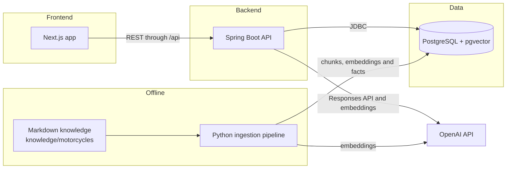

# Repair V2

Repair V2 is an AI assisted maintenance companion for motorcycle owners. You choose your bike, ask questions and can record maintenance directly from the chat so it becomes part of a real service history instead of staying buried in a conversation.

This is a portfolio demo rather than a finished commercial product. The goal is to show a complete RAG and persistence workflow from end to end while keeping the scope small enough to test properly.

## Project story

Repair originally started as a broader vehicle maintenance assistant, with cars as the first direction.

As I worked on retrieval, ingestion, persistence, maintenance tracking and model specific knowledge, it became clear that trying to cover too many vehicles at once made the system harder to validate. A smaller domain made it much easier to check whether the retrieval was actually relevant, whether structured maintenance data was reliable and whether the whole flow worked consistently.

For V2 I narrowed the project to motorcycles and, for the current demo, to a curated set of popular Yamaha models and supported years.

That gave me a cleaner knowledge base to work with and a better environment for building the RAG pipeline, ingestion process, structured fact extraction and maintenance logic properly.

The architecture is still data driven. Manufacturer, model and year are treated as first class dimensions, so the project can grow later without having to rebuild the core application.

## What it does

1. Pick a manufacturer, model and year from the catalogue. The current demo focuses on Yamaha.

2. Add motorcycles to a personal garage and keep track of the current odometer.

3. Keep separate conversation history for each physical motorcycle.

4. Ask maintenance and basic troubleshooting questions with retrieval scoped to the selected manufacturer, model and year.

5. Inspect the evidence used for an answer, including the retrieved chunks and ranking information.

6. Record completed maintenance from natural language such as `"I changed the oil at 12,400 km"`.

7. Distinguish confirmed maintenance from hypothetical, planned or uncertain statements so those messages do not accidentally become service records.

8. View maintenance history and service status using structured facts when verified interval data exists for that bike.

9. Sign in with Google and keep garage vehicles, conversations and maintenance records isolated by user.

10. Delete a motorcycle together with the data that belongs to it.

## Architecture



The database still contains some of the broader vehicle and car oriented tables from the first version of the idea, including `manufacturers`, `vehicle_models` and `diagnostic_sessions`.

The current motorcycle demo uses the motorcycle specific domain built around `motorcycle_*`, `garage_vehicles` and `moto_chat_*`. The older tables were left in place because they show how the project evolved, but the running motorcycle flow does not depend on them.

### Backend (`apps/api`)

The API uses Java 21 and Spring Boot 4.1 with plain JDBC through `JdbcClient`. There is no JPA or Hibernate layer.

Writes go through parameterized repository methods rather than model generated SQL.

Main areas under `dev.repair.api`:

1. `motochat` handles the motorcycle chat flow, retrieval, evidence building, structured generation, citation validation and maintenance or odometer actions.

2. `motorcycle` contains the catalogue and structured motorcycle facts.

3. `garage` handles user motorcycles, maintenance events and dashboard logic.

4. `conversation` and `chat` contain the earlier, more general conversation and retrieval pieces from the original vehicle prototype.

5. `auth` handles Google OAuth2 and OIDC login.

6. `dataquality`, `catalogue`, `common`, `config` and `web` contain supporting application concerns.

### Frontend (`apps/web`)

The frontend uses Next.js 16 with the App Router, React 19 and TypeScript.

`next dev` and `next build` proxy `/api/*` to the Spring Boot API through `API_ORIGIN`, so the browser can work through a single origin during local development.

The main routes live under `src/app/chat`, `src/app/garage` and `src/app/quality`.

### Database (`apps/api/src/main/resources/db/migration`)

The database is PostgreSQL with pgvector and Flyway migrations from `V1` to `V11`.

The main parts used by the motorcycle demo are:

1. **Catalogue**

   `motorcycle_manufacturers` connects to `motorcycle_models`. Model aliases are stored in `motorcycle_model_aliases` and ingested knowledge documents are stored in `motorcycle_knowledge_documents`.

2. **Knowledge**

   `motorcycle_knowledge_chunks` stores chunked text together with a `vector(1536)` embedding. The table uses an HNSW vector index and a GIN full text index.

   `motorcycle_facts` stores deterministic structured facts extracted from the same source documents.

3. **Garage and ownership**

   `app_users` owns `garage_vehicles`. Maintenance history lives in `maintenance_events` and per vehicle preferences are stored in `vehicle_preferences`.

4. **Chat and evidence**

   `moto_chat_sessions` contains `moto_chat_messages`.

   Each retrieval run is stored in `moto_rag_runs`, while `moto_retrieved_evidence` keeps the chunks and their vector, text and fused ranking information for the evidence view.

### Knowledge base (`knowledge/motorcycles`)

The source knowledge is human readable and version controlled. There is one Markdown file per supported model and year.

```text
knowledge/
  motorcycles/
    yamaha/
      <model-slug>/
        <year>.md
```

Each file begins with YAML front matter containing information such as manufacturer, model, year range, market, aliases and last verified date.

The rest of the file is organised into consistent Markdown sections for specifications, maintenance and troubleshooting.

The content is curated, model specific technical and maintenance information.

### Ingestion pipeline (`pipelines`)

The ingestion pipeline is a standalone Python package under `pipelines/ingest` and `pipelines/embeddings`.

For the motorcycle knowledge base, `ingest-motorcycle-knowledge` does the following:

1. Scans `knowledge/motorcycles/**/*.md`.

2. Parses YAML front matter and Markdown content.

3. Hashes documents and chunks so unchanged content can be skipped on later runs.

4. Splits the content using the document structure and headings.

5. Creates embeddings for new or changed chunks.

6. Synchronizes documents, chunks and embeddings with PostgreSQL and pgvector.

7. Runs `motorcycle_facts.py` separately to extract deterministic structured maintenance facts.

The project uses two complementary knowledge layers.

### RAG knowledge chunks

These are used for semantic answers and evidence in the chat. They are useful for explanation, troubleshooting and questions where the answer depends on surrounding context.

### Structured facts

These are used for deterministic behaviour such as service intervals, dashboard status and next due calculations.

If a fact cannot be extracted from a supported pattern, it is simply left unknown rather than guessed.

### Retrieval

`MotoRetrievalService` performs hybrid retrieval for each chat turn.

It combines pgvector cosine similarity over `motorcycle_knowledge_chunks.embedding` with PostgreSQL full text search over the same chunks.

Both searches are restricted to the selected motorcycle and year, then combined with Reciprocal Rank Fusion.

The final ranking and the individual scores are stored in `moto_rag_runs` and `moto_retrieved_evidence`, which is also what powers the evidence and debug view in the interface.

### Model calls

`OpenAiClient` is a small HTTP wrapper around the OpenAI API.

It uses `POST /v1/responses` for structured chat generation and `POST /v1/embeddings` for query time and ingestion time embeddings.

The default embedding model is `text-embedding-3-small`.

## Local development

### 1. Environment

```bash
cp .env.example .env

# Fill in OPENAI_API_KEY for chat and embeddings
# Fill in GOOGLE_CLIENT_ID and GOOGLE_CLIENT_SECRET for sign in
# See docs/authentication.md
```

The Java API and Python pipeline load the `.env` file automatically by searching upward through the project.

Docker Compose uses its own defaults for the local database.

### 2. Database

```bash
docker compose up -d db
```

This starts PostgreSQL 17 with pgvector on `localhost:5544`.

Flyway runs the migrations automatically when the API starts.

### 3. Backend API

```bash
cd apps/api
./mvnw spring-boot:run
```

The API runs on `http://localhost:8082`.

### 4. Frontend

```bash
cd apps/web
npm install
npm run dev
```

The frontend runs on `http://localhost:3000`.

### 5. Ingest or refresh the knowledge base

```bash
cd pipelines
python -m venv .venv
source .venv/bin/activate
pip install -e ".[dev]"
python -m ingest.cli ingest-motorcycle-knowledge
```

Use `--dry-run` to parse and chunk without writing embeddings.

Use `--facts-only` when you only want to refresh structured facts from documents that have already been ingested.

## Tests

### Java

Run from `apps/api`.

```bash
./mvnw test
```

### Python

Run from `pipelines` with the virtual environment active.

```bash
pytest
```

### TypeScript

Run from `apps/web`.

```bash
npx tsc --noEmit
npm run build
```

### End to end

Run from `apps/web` with the API and database already running.

```bash
npm run test:e2e
```

## Current scope and future direction

The current demo focuses on Yamaha and a curated set of models and years.

That scope is intentional. It is large enough to test retrieval, ingestion, persistence and maintenance logic properly, while still being small enough to keep the data controlled and easy to verify.

The schema and ingestion pipeline do not depend on having a single manufacturer.

The next step would be to add more motorcycle manufacturers and expand the knowledge base. From there, the project can move back toward the broader vehicle idea that Repair started with once the same architecture has been tested against a wider range of data.
