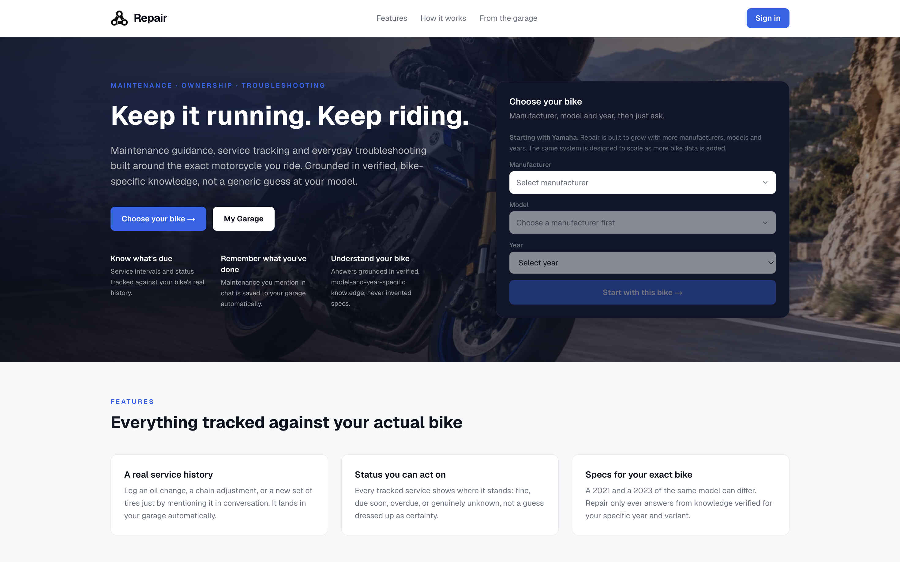
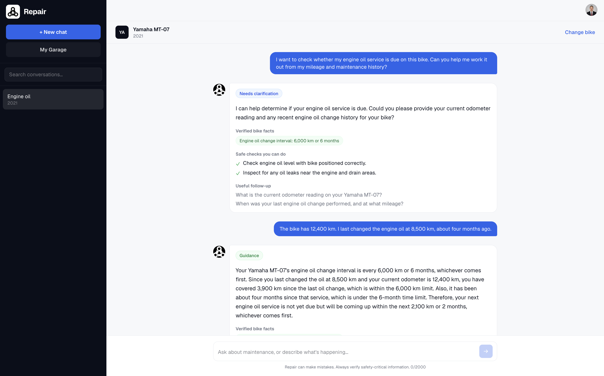
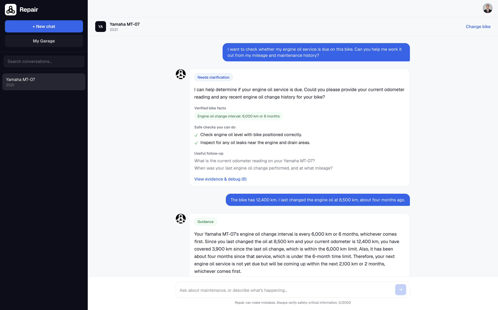
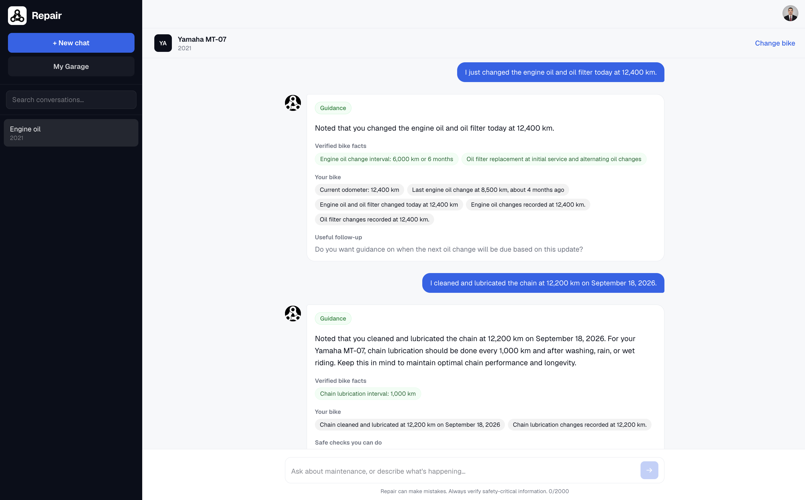
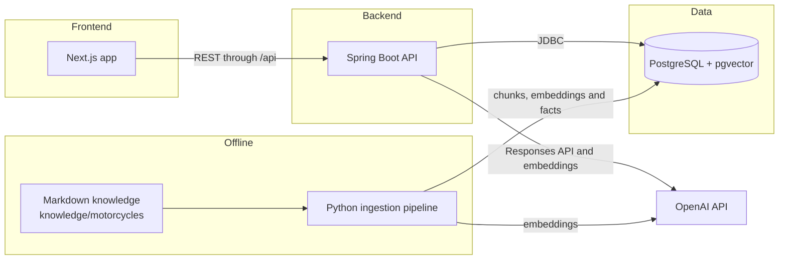
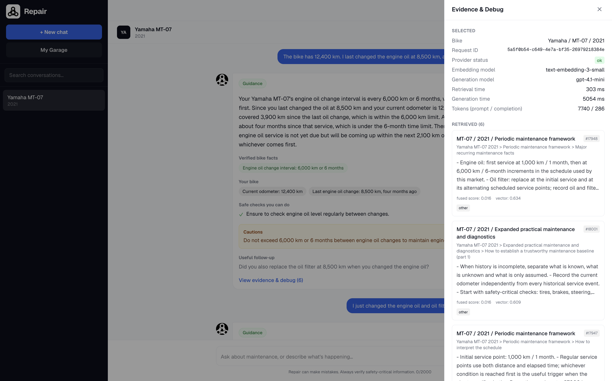
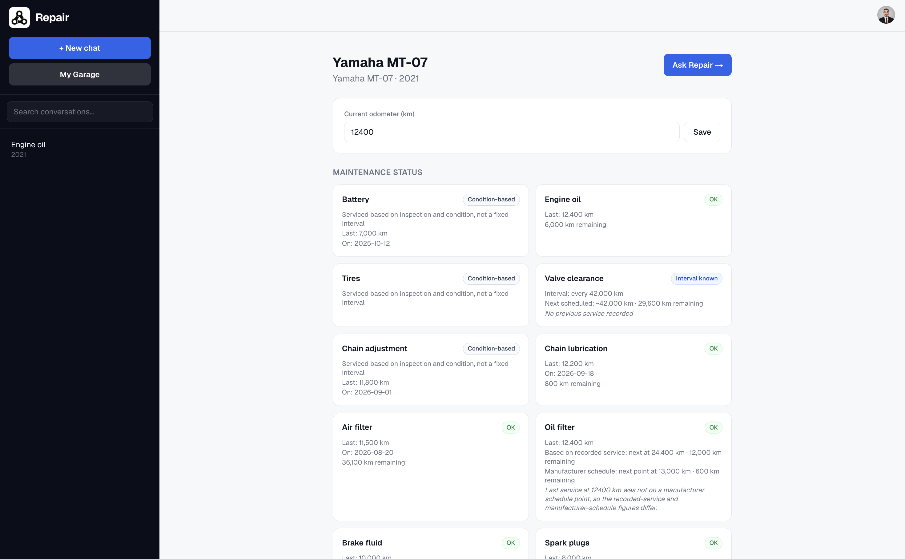
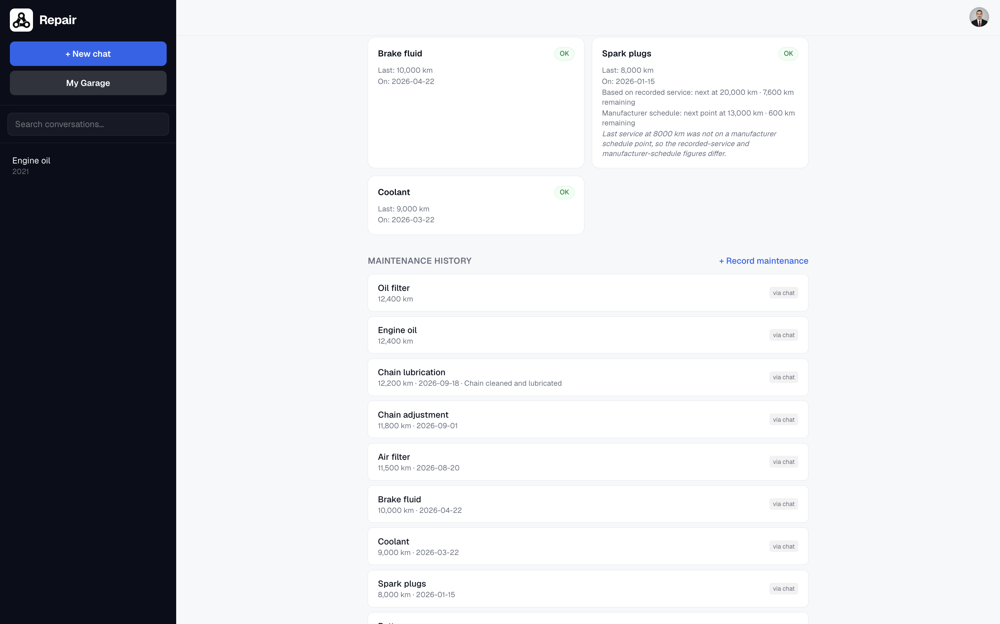

# Repair

Repair is an AI assisted maintenance companion for motorcycle owners. You choose your bike, ask questions and can record maintenance directly from the chat so it becomes part of a real service history instead of staying buried in a conversation.

This is a portfolio demo rather than a finished commercial product. The goal is to show a complete RAG and persistence workflow from end to end while keeping the scope small enough to test properly.


<p align="center"><em>Repair combines bike-specific maintenance guidance, service tracking and troubleshooting in one application.</em></p>

## Project story

Repair started as a broader vehicle maintenance assistant, and the first version of the idea included cars.

As the work moved into retrieval, ingestion, persistence and structured maintenance data, the quality of the knowledge behind each answer became the main thing to get right. With a wide vehicle range it was hard to check whether retrieval was actually relevant for a specific vehicle, or whether an extracted service interval could be trusted.

So I narrowed the active demo to motorcycles, and for now to a curated set of Yamaha models. A smaller domain made it practical to curate and validate the knowledge base model by model and year by year. That in turn made it possible to test retrieval against known content, extract structured maintenance facts deterministically, trace every answer back to the chunks it used, persist service history per bike and build service-status logic on top of verified data.

The architecture is still manufacturer, model and year driven. Those are first class dimensions in the schema, the knowledge layout and the retrieval filters, so coverage can grow later without rebuilding the core application.

## What it does

1. Pick a manufacturer, model and year from the catalogue. The current demo focuses on Yamaha.

2. Add motorcycles to a personal garage and keep track of the current odometer.

3. Keep separate conversation history for each physical motorcycle.

4. Ask maintenance and basic troubleshooting questions with retrieval scoped to the selected manufacturer, model and year.

5. Inspect the evidence used for an answer, including the retrieved chunks and ranking information.

6. Record completed maintenance from natural language such as `"I changed the oil at 12,400 km"`.

7. Distinguish confirmed maintenance from hypothetical, planned or uncertain statements so those messages do not accidentally become service records.

8. View maintenance history and a per-service status for each bike. Status is calculated where a verified interval exists, shown as condition-based for items such as tires that have no fixed interval, and left unknown only when verified information is missing.

9. Sign in with Google and keep garage vehicles, conversations and maintenance records isolated by user.

10. Delete a motorcycle together with the data that belongs to it.

## Product walkthrough

The examples below follow one Yamaha MT-07 2021 through a typical session.

### Missing context

Asking whether a service is due depends on information the model cannot know on its own. When the current odometer or the last service is missing, Repair asks for it rather than assuming a mileage.


<p align="center"><em>When required context is missing, Repair asks for the rider's maintenance history instead of guessing.</em></p>

### Grounded answer

Once the rider gives the odometer (12,400 km) and the last oil change (8,500 km), the answer combines the verified engine oil interval for that model and year with the bike's own history. It works out what remains before the next service and adds safe checks, cautions and a follow-up question.


<p align="center"><em>Repair combines verified model-specific intervals with the motorcycle's actual mileage and service history to calculate what is due next.</em></p>

### Recording maintenance

Completed work described in plain language is turned into structured maintenance events for that motorcycle. The oil change and the filter replacement are stored as separate events. The confirmation shown in the answer is rebuilt from the database after the write, not taken from the model's own wording.


<p align="center"><em>Confirmed maintenance described naturally in chat is converted into structured service history for that motorcycle.</em></p>

The recorded history then feeds My Garage, described under [My Garage and service status](#my-garage-and-service-status), and every answer links to the evidence it was built from, described under [Retrieval](#retrieval).

## Architecture



The running application is built around the motorcycle domain: the `motorcycle_*` catalogue and knowledge tables, `garage_vehicles`, `maintenance_events` and the `moto_chat_*` / `moto_rag_*` chat and evidence tables. Some tables from the earlier, broader vehicle prototype are still in the schema; see [Legacy tables](#legacy-tables).

### Backend (`apps/api`)

The API uses Java 21 and Spring Boot 4.1 with plain JDBC through `JdbcClient`. There is no JPA or Hibernate layer.

Writes go through parameterized repository methods rather than model generated SQL.

Main areas under `dev.repair.api`:

1. `motochat` handles the motorcycle chat flow, retrieval, evidence building, structured generation, citation validation and maintenance or odometer actions.

2. `motorcycle` contains the catalogue and structured motorcycle facts.

3. `garage` handles user motorcycles, maintenance events and the service-status logic behind My Garage.

4. `auth` handles Google OAuth2 and OIDC login.

5. `conversation` and `chat` contain the earlier, more general conversation and retrieval pieces from the original vehicle prototype. The motorcycle flow does not use them.

6. `dataquality`, `catalogue`, `common`, `config` and `web` contain supporting application concerns.

### Frontend (`apps/web`)

The frontend uses Next.js 16 with the App Router, React 19 and TypeScript.

`next dev` and `next build` proxy `/api/*` to the Spring Boot API through `API_ORIGIN`, so the browser can work through a single origin during local development.

The main routes live under `src/app/chat` and `src/app/garage`. `src/app/quality` is a data-quality view left over from the earlier vehicle prototype.

### Database (`apps/api/src/main/resources/db/migration`)

The database is PostgreSQL with pgvector and Flyway migrations from `V1` to `V11`.

The parts used by the motorcycle application are:

1. **Catalogue**

   `motorcycle_manufacturers` connects to `motorcycle_models`. Model aliases are stored in `motorcycle_model_aliases` and ingested knowledge documents are stored in `motorcycle_knowledge_documents`.

2. **Knowledge**

   `motorcycle_knowledge_chunks` stores chunked text together with a `vector(1536)` embedding. The table uses an HNSW vector index and a GIN full text index.

   `motorcycle_facts` stores deterministic structured facts extracted from the same source documents.

3. **Garage and ownership**

   `app_users` owns `garage_vehicles`. Maintenance history lives in `maintenance_events` and per vehicle preferences are stored in `vehicle_preferences`.

4. **Chat and evidence**

   `moto_chat_sessions` contains `moto_chat_messages`.

   Each retrieval run is stored in `moto_rag_runs`, while `moto_retrieved_evidence` keeps the chunks and their vector, text and fused ranking information for the evidence view.

#### Legacy tables

The schema still contains tables from the first, broader vehicle version of the idea, including `manufacturers`, `vehicle_models` and `diagnostic_sessions`. They were left in place because they show how the project evolved, but the running motorcycle flow does not depend on them.

### Knowledge base (`knowledge/motorcycles`)

The source knowledge is human readable and version controlled. There is one Markdown file per supported model and year.

```text
knowledge/
  motorcycles/
    yamaha/
      <model-slug>/
        <year>.md
```

Each file begins with YAML front matter containing information such as manufacturer, model, year range, market, aliases and last verified date.

The rest of the file is organised into consistent Markdown sections for specifications, maintenance and troubleshooting.

The content is curated, model specific technical and maintenance information.

### Ingestion pipeline (`pipelines`)

The ingestion pipeline is a standalone Python package under `pipelines/ingest` and `pipelines/embeddings`.

For the motorcycle knowledge base, `ingest-motorcycle-knowledge` does the following:

1. Scans `knowledge/motorcycles/**/*.md`.

2. Parses YAML front matter and Markdown content.

3. Hashes documents and chunks so unchanged content can be skipped on later runs.

4. Splits the content using the document structure and headings.

5. Creates embeddings for new or changed chunks.

6. Synchronizes documents, chunks and embeddings with PostgreSQL and pgvector.

7. Runs `motorcycle_facts.py` separately to extract deterministic structured maintenance facts.

The project uses two complementary knowledge layers.

### RAG knowledge chunks

These are used for semantic answers and evidence in the chat. They are useful for explanation, troubleshooting and questions where the answer depends on surrounding context.

### Structured facts

These are used for deterministic behaviour such as service intervals, dashboard status and next due calculations.

Extraction is regex and structure based, never model based. It covers values such as service intervals, oil and coolant capacities, spark plug type and gap, tire pressures and tightening torques. Where a knowledge file lists fixed manufacturer schedule points rather than a plain "every X km" interval, the stated points are extracted as well. For example, the MT-07 2021 file lists oil filter replacement at 1,000, 13,000 and 25,000 km.

If a fact cannot be extracted from a supported pattern, it is simply left unknown rather than guessed. The value is still available to the chat through normal chunk retrieval.

### Retrieval

`MotoRetrievalService` performs hybrid retrieval for each chat turn.

It combines pgvector cosine similarity over `motorcycle_knowledge_chunks.embedding` with PostgreSQL full text search over the same chunks.

Both searches are restricted to the selected motorcycle and year, then combined with Reciprocal Rank Fusion.

The final ranking and the individual scores are stored in `moto_rag_runs` and `moto_retrieved_evidence`, which is also what powers the evidence and debug view in the interface.


<p align="center"><em>The evidence view exposes the selected motorcycle, model calls, retrieval timings and ranked knowledge chunks used to ground each answer.</em></p>

### My Garage and service status

`MaintenanceStatusService` computes one status card per service type from two inputs: structured facts for the bike's model and year, and the maintenance events recorded for that specific motorcycle. No model is involved in this calculation.

Not every maintenance item has a fixed interval, so the dashboard keeps several cases apart:

1. **Resettable intervals.** Engine oil, for example, is due a fixed distance or time after the last recorded service. With history, the card shows OK, Due soon, Due or Overdue. Without history, it shows Interval known.

2. **Manufacturer schedule points.** Where the knowledge file lists fixed service points, as it does for the MT-07 2021 oil filter and spark plugs, the card shows two separate figures: the next service *based on recorded service*, and the next point on the *manufacturer schedule*. If the last service was done early or late, the card says the two differ rather than silently picking one.

3. **Condition-based items.** Tires, chain adjustment and battery replacement are serviced on inspection and condition, not on a fixed interval. They are labelled Condition-based and still show any recorded replacement.

4. **Missing information.** A service with no verified interval but some recorded history is shown as Tracked. Unknown is used only when there is no verified interval and nothing recorded.


<p align="center"><em>My Garage combines recorded maintenance, verified service intervals and condition-based items into a live maintenance status for each motorcycle.</em></p>

Maintenance recorded through chat or through the form on this page is stored per motorcycle and listed in order, independent of the conversation it came from.


<p align="center"><em>Maintenance captured through conversation becomes a persistent, chronological service history tied to the motorcycle.</em></p>

More detail on the status rules is in `docs/maintenance-tracking.md`.

### Model calls

`OpenAiClient` is a small HTTP wrapper around the OpenAI API.

It uses `POST /v1/responses` for structured chat generation and `POST /v1/embeddings` for query time and ingestion time embeddings.

The default generation model is `gpt-4.1-mini` and the default embedding model is `text-embedding-3-small`. Both can be overridden with `OPENAI_GENERATION_MODEL` and `OPENAI_EMBEDDING_MODEL`.

## Local development

### 1. Environment

```bash
cp .env.example .env

# Fill in OPENAI_API_KEY for chat and embeddings
# Fill in GOOGLE_CLIENT_ID and GOOGLE_CLIENT_SECRET for sign in
# See docs/authentication.md
```

The Java API and Python pipeline load the `.env` file automatically by searching upward through the project.

Docker Compose uses its own defaults for the local database.

### 2. Database

```bash
docker compose up -d db
```

This starts PostgreSQL 17 with pgvector on `localhost:5544`.

Flyway runs the migrations automatically when the API starts.

### 3. Backend API

```bash
cd apps/api
./mvnw spring-boot:run
```

The API runs on `http://localhost:8082`.

### 4. Frontend

```bash
cd apps/web
npm install
npm run dev
```

The frontend runs on `http://localhost:3000`.

### 5. Ingest or refresh the knowledge base

```bash
cd pipelines
python -m venv .venv
source .venv/bin/activate
pip install -e ".[dev]"
python -m ingest.cli ingest-motorcycle-knowledge
```

Use `--dry-run` to parse and chunk without writing embeddings.

Use `--facts-only` when you only want to refresh structured facts from documents that have already been ingested.

## Tests

### Java

Run from `apps/api`.

```bash
./mvnw test
```

### Python

Run from `pipelines` with the virtual environment active.

```bash
pytest
```

### TypeScript

Run from `apps/web`.

```bash
npx tsc --noEmit
npm run build
```

### End to end

Run from `apps/web` with the API and database already running.

```bash
npm run test:e2e
```

## Current scope and future direction

The current demo covers Yamaha only: 111 curated model-year files across 20 Yamaha models, with the depth of coverage varying by model.

That scope is intentional. It is large enough to test retrieval, ingestion, persistence and maintenance logic properly, while still being small enough to keep the data controlled and easy to verify.

The schema and ingestion pipeline do not depend on having a single manufacturer.

The next step would be to add more motorcycle manufacturers and expand the knowledge base. From there, the project can move back toward the broader vehicle idea that Repair started with once the same architecture has been tested against a wider range of data.
